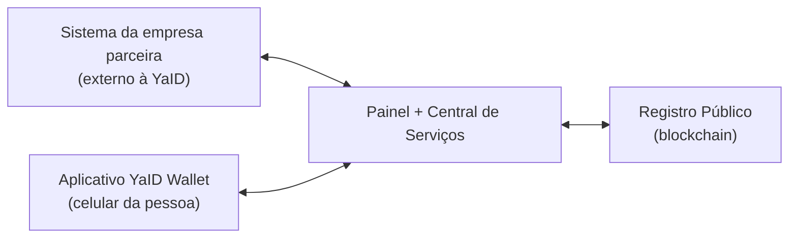

# YaID — Visão Geral do Projeto

> **O que é este documento.** Uma visão de partida (baseline) do projeto **como um todo** — não
> de uma codebase específica. Ele explica o que é a YaID, qual problema ela resolve, quais são
> as frentes que compõem a solução e em que momentos elas conversam entre si.
>
> É deliberadamente escrito em linguagem natural, sem detalhes técnicos, e é **autossuficiente**:
> serve como ponto de partida comum para qualquer uma das frentes, sem depender de outros
> documentos. Requisitos, decisões e vocabulário preciso de cada frente ficam nos documentos
> próprios de cada uma.

---

## 1. O que é a YaID

A YaID é uma plataforma de **verificação de identidade sem entrega de dados pessoais**.

Ela funciona como uma intermediária de confiança entre três partes:

- **A pessoa** que precisa provar algo sobre si mesma (que é uma pessoa real, que é maior de idade);
- **A empresa** que precisa dessa prova para liberar um cadastro, uma compra ou um acesso;
- **A própria YaID**, que confere o documento da pessoa uma única vez e, a partir dali, passa a
  responder às empresas apenas com um "sim" ou "não".

A ideia central é simples: **a pessoa comprova o documento uma vez e reaproveita essa comprovação
em qualquer empresa parceira**, sem nunca mais reenviar foto de documento, nome, CPF ou data de
nascimento — e sem que a YaID guarde nada disso.

Do lado da empresa, a experiência é a de contratar um serviço: ela se cadastra, pede uma
verificação, direciona seu usuário e recebe de volta a resposta. Ela nunca vê o documento nem os
dados da pessoa.

### As duas perguntas que a YaID responde

O escopo é deliberadamente estreito. A YaID responde **exatamente duas perguntas**, e ambas só
admitem "sim" ou "não":

| Pergunta | O que significa | O que **não** significa |
|---|---|---|
| **"É uma pessoa real?"** | Existe uma pessoa por trás daquela identidade, confirmada a partir de um documento de identidade conferido pela YaID. Serve contra contas falsas, robôs e cadastros em massa. | Não diz **qual** pessoa é. Não é uma identificação, não devolve nome nem confirma que é o titular do cadastro da empresa. |
| **"Tem mais de 18 anos?"** | A data de nascimento lida no documento indica maioridade. | Não diz a idade, nem a data de nascimento, nem qualquer outra faixa etária. |

Regras que delimitam esse escopo:

- **Cada pedido de verificação faz uma pergunta só.** Se a empresa precisa das duas respostas, faz
  dois pedidos separados.
- **A resposta é sempre binária.** Não existe pontuação, nível de confiança ou resposta parcial.
- **A pergunta é escolhida pela empresa** no momento do pedido — não há catálogo configurável nem
  perguntas personalizadas.
- **Não há nenhuma outra pergunta possível.** Nome, CPF, endereço, idade exata, nacionalidade,
  estado civil, renda ou qualquer outro atributo estão fora do escopo, por decisão de produto e não
  por limitação temporária.

### O que a comprovação envolve — e o que não envolve

A comprovação acontece uma única vez e consiste em **uma coisa só: a pessoa envia, pelo aplicativo,
uma foto de um documento de identidade** (no escopo atual, o RG). A YaID lê esse documento, deriva
as duas respostas e descarta a imagem e os dados lidos.

Não faz parte da comprovação: selfie, prova de vida, comparação facial, vídeo, leitura de outros
documentos, consulta a bases externas ou qualquer etapa presencial. Quem envia a foto é a mesma
pessoa que controla o aplicativo — o vínculo entre a pessoa e sua credencial vem do aparelho, não
de biometria.

> **Contexto do projeto.** A YaID é desenvolvida como trabalho de conclusão de curso, com objetivo
> de demonstrar uma plataforma de identidade auto-soberana funcionando de ponta a ponta —
> comprovação, apresentação, verificação e cancelamento — e não apenas no papel. Isso explica
> algumas escolhas de escopo enxuto ao longo dos documentos de produto.

---

## 2. A dor que a YaID resolve

### Para a empresa

Hoje, uma empresa que precisa saber se seu usuário é uma pessoa real (ou se tem mais de 18 anos)
escolhe entre alternativas ruins:

| Caminho atual | Problema |
|---|---|
| Pedir o documento direto ao usuário | Atrito no cadastro, risco de vazamento, custo e responsabilidade de guardar dado sensível |
| Contratar um serviço tradicional de verificação | Caro e, mesmo assim, faz circular mais dado pessoal do que o necessário |
| Ignorar o problema | Contas falsas, fraude, menores acessando o que não deveriam |
| Construir a solução por conta própria | Exige dominar um assunto que não é o negócio da empresa |

O incômodo de fundo é que a empresa **não quer o dado pessoal** — ela quer só a resposta. Mas as
soluções disponíveis obrigam a receber e guardar o dado para chegar até a resposta.

### Para a pessoa

A pessoa entrega foto de documento, CPF e data de nascimento repetidamente, para cada empresa nova,
sem saber o que foi guardado, por quem, por quanto tempo, nem como pedir a exclusão. Cada novo
cadastro é um novo lugar onde seus dados podem vazar.

### A proposta da YaID

Separar **a comprovação** do **uso da comprovação**:

1. A pessoa comprova sua identidade **uma vez**, direto com a YaID, pelo aplicativo;
2. Essa comprovação vira uma credencial que fica **guardada no celular da pessoa** — não em um
   servidor da YaID;
3. Quando uma empresa precisa de uma verificação, a pessoa **autoriza** o uso dessa credencial, e a
   empresa recebe apenas o resultado.

Três compromissos sustentam isso e não são negociáveis em nenhuma decisão futura:

- **Nenhum dado pessoal da pessoa fica guardado na YaID.** O documento é conferido durante a
  comprovação e descartado em seguida.
- **A empresa nunca recebe a credencial nem os dados da pessoa** — recebe "válido" ou "não válido"
  e informações do próprio pedido.
- **A credencial carrega apenas respostas de sim/não** ("é uma pessoa real", "é maior de 18") —
  nunca nome, CPF, foto ou data de nascimento.

---

## 3. As frentes que compõem a solução

A YaID é composta por **três projetos distintos**, mantidos separadamente, mais um quarto
participante que é externo (o sistema da própria empresa cliente).

Todo o tráfego passa pela Central de Serviços. **Nem a empresa nem o aplicativo falam diretamente
com o registro público** — só a Central escreve e consulta lá.

### 3.1 Painel Empresarial + Central de Serviços

É o coração da plataforma e reúne três papéis em um só projeto:

- **Painel da empresa** — a área logada onde a empresa se cadastra, cria suas aplicações, obtém a
  chave de acesso, configura para onde quer receber as respostas e acompanha o histórico de
  verificações com seus status.
- **Página de verificação** — a página pública que a pessoa abre no navegador quando é direcionada
  pela empresa. Ela explica, em linguagem simples, quem está pedindo a verificação e o que está
  sendo pedido, e oferece o botão que abre o aplicativo.
- **Central de serviços** — a camada que atende a todos: o painel, o sistema da empresa e o
  aplicativo da pessoa. É ela que confere o documento no momento da comprovação, emite a
  credencial, valida as autorizações recebidas do aplicativo, conversa com o registro público e
  avisa a empresa do resultado.

Também é aqui que vive a separação de ambientes: cada aplicação criada pela empresa é marcada como
**homologação** (para testes, onde é possível aprovar ou reprovar um pedido manualmente pelo
painel) ou **produção**.

### 3.2 Aplicativo YaID Wallet

É a carteira da pessoa, instalada no celular. Guarda a identidade digital e a credencial emitida
pela YaID e é a única coisa capaz de autorizar uma verificação em nome daquela pessoa.

Responsabilidades:

- solicitar a criacao de uma senha de acesso (6 dígitos) ao app no primeiro uso
- criar a identidade da pessoa no primeiro uso, localmente no aparelho;
- enviar a foto do documento para a comprovação inicial e receber de volta a credencial;
- guardar a credencial no próprio aparelho;
- receber o pedido de verificação (a partir do botão na página de verificação), mostrar à pessoa
  quem está pedindo o quê, e autorizar ou recusar;
- cancelar a credencial, se a pessoa quiser.

Não existe cadastro, login, e-mail ou senha da pessoa em nenhum servidor da YaID: quem tem o
aparelho e a identidade criada nele é a pessoa.

### 3.3 Registro Público

É o registro em blockchain que dá caráter público e não adulterável a duas informações — e somente
a essas duas:

1. **Quais identidades já tiveram documento conferido pela YaID.** É o que permite a qualquer
   verificação futura confirmar que aquela credencial nasceu de uma conferência real.
2. **Quais credenciais foram canceladas.** É o que impede o uso de uma credencial que a pessoa
   pediu para invalidar.

O registro **não contém nome, CPF, documento, foto, nem qualquer conteúdo da credencial**. Ele é o
único lugar centralizado onde algo relativo à pessoa existe — e é justamente por não conter dado
pessoal que pode ser público.

Só a YaID escreve nesse registro; qualquer um pode consultá-lo.

### 3.4 Sistema da empresa parceira (participante externo)

Não é um projeto da YaID, mas participa do fluxo. É o site ou aplicativo da empresa cliente, que
pede a verificação, direciona seu usuário e recebe o resultado para seguir com o próprio processo
(liberar cadastro, autorizar compra etc.).

---

## 4. Quando e como os sistemas conversam

A comunicação entre as frentes não é contínua — ela acontece em **momentos bem definidos**. Abaixo,
cada momento, quem fala com quem e o que trafega.

### Momento 1 — A empresa se prepara (uma vez)

**Painel ⇄ Central**

A empresa se cadastra pelo painel, cria uma aplicação e recebe uma chave de acesso — mostrada uma
única vez, para ser guardada por ela. Também informa para onde quer receber os avisos de resultado.
A partir daqui, o sistema da empresa consegue se identificar perante a YaID.

*Nenhum outro sistema participa deste momento.*

### Momento 2 — A pessoa comprova sua identidade (uma vez)

**Aplicativo → Central → Registro Público → Central → Aplicativo**

A pessoa instala o aplicativo, que cria a identidade dela no aparelho, e envia **uma foto do
documento de identidade** — é a única coisa que ela envia, e a única vez em que envia. A Central lê
o documento e deriva ali mesmo as duas respostas ("é uma pessoa real", "tem mais de 18"), registra
no registro público que aquela identidade foi conferida, devolve a credencial ao aplicativo e
**descarta imediatamente** a foto e os dados lidos.

A credencial devolvida já carrega as duas respostas — a pessoa não precisa repetir a comprovação
para responder a uma pergunta diferente depois.

Ao final, a credencial existe apenas no celular da pessoa; e o registro público sabe apenas que
aquela identidade foi conferida.

*Este momento é independente dos demais: pode acontecer muito antes de qualquer empresa pedir algo.*

### Momento 3 — A empresa pede uma verificação

**Sistema da empresa → Central**

Quando precisa validar um usuário, o sistema da empresa faz o pedido à Central escolhendo **uma das
duas perguntas** — "é uma pessoa real" ou "tem mais de 18 anos" — e, se quiser, informando uma
referência interna própria para reconhecer o pedido depois. Precisando das duas respostas, abre
dois pedidos. A Central cria o pedido e devolve um **link de verificação** de uso único, com
validade de 30 minutos.

### Momento 4 — A pessoa é levada até a verificação

**Sistema da empresa → navegador da pessoa → Central**

A empresa direciona seu usuário para o link recebido. A página de verificação, servida pela
Central, mostra qual empresa está pedindo e o que está sendo pedido, e oferece o botão que abre o
aplicativo. A página fica acompanhando o andamento e se atualiza sozinha conforme o estado muda —
aguardando, em andamento, aprovado, recusado ou expirado.

### Momento 5 — A pessoa autoriza pelo aplicativo

**Aplicativo ⇄ Central ⇄ Registro Público**

Ao tocar no botão, a pessoa é levada ao aplicativo, que se conecta à Central para saber do que se
trata. A pessoa vê o pedido e decide. Se autorizar, o aplicativo monta e envia a autorização
usando a credencial que guarda.

A Central então confere tudo: se a autorização é realmente daquela pessoa, se corresponde ao pedido
em aberto, se a credencial foi mesmo emitida pela YaID e se a identidade consta como conferida e a
credencial não foi cancelada — estas duas últimas verificações são consultas ao registro público.

Se algo não bate, o pedido é recusado. A pessoa também pode simplesmente recusar, e o pedido pode
ainda expirar sozinho se ninguém agir dentro do prazo.

### Momento 6 — O resultado volta para a empresa

**Central → Sistema da empresa** e **Central → Painel**

Assim que o pedido chega a um resultado (aprovado, recusado ou expirado), a Central avisa
automaticamente o sistema da empresa, no endereço que ela configurou, informando o resultado e os
dados do próprio pedido. Se esse aviso não chegar, a empresa pode consultar o resultado por conta
própria a qualquer momento.

Em paralelo, o pedido aparece com seu status atualizado no painel, com o histórico do que aconteceu.

**O que a empresa recebe:** o resultado, o identificador do pedido, o que foi pedido, a referência
interna dela e o momento da atualização.
**O que a empresa não recebe, em nenhuma hipótese:** o documento, os dados pessoais, a credencial
ou a autorização enviada pela pessoa.

### Momento 7 — A pessoa cancela sua credencial

**Aplicativo → Central → Registro Público**

A qualquer momento, e só por iniciativa da própria pessoa, ela pode cancelar sua credencial pelo
aplicativo. A Central registra o cancelamento no registro público. A partir daí, qualquer nova
tentativa de usar aquela credencial é recusada nas verificações seguintes.

A YaID não tem como cancelar a credencial de alguém por conta própria.

---

## 5. Fronteiras de privacidade — quem vê o quê

| | Documento e dados pessoais | Credencial da pessoa | Resultado da verificação |
|---|---|---|---|
| **Pessoa (aplicativo)** | São dela; a foto do documento sai do aparelho uma única vez, na comprovação | Tem, e é a única que tem | Vê |
| **Central de Serviços** | Vê apenas durante a comprovação, e descarta | Emite, não guarda | Registra e informa |
| **Empresa parceira** | Nunca vê | Nunca vê | Recebe |
| **Registro Público** | Nunca contém | Nunca contém | Não contém — guarda só a marca de "identidade conferida" e de "credencial cancelada" |

As informações que a YaID guarda de forma permanente são exclusivamente do **lado empresarial**:
os dados cadastrais da empresa, suas aplicações, os pedidos de verificação e o andamento de cada
um. Nada sobre a pessoa.

---

## 6. Estado atual (baseline)

Um retrato de onde cada frente está, para servir de ponto de partida:

| Frente | Situação |
|---|---|
| **Painel + Central de Serviços** | Frente mais avançada. Cadastro da empresa, gestão de aplicações e chaves de acesso, criação e acompanhamento de pedidos de verificação, página de verificação e os fluxos de comprovação e autorização já existem. Segue em evolução: refinamentos do painel, avisos automáticos à empresa e ajustes de ambiente por aplicação. |
| **Aplicativo YaID Wallet** | Ainda a ser construído. Enquanto não existe, os fluxos da pessoa são exercitados por simulação, seguindo um roteiro de teste que percorre o caminho completo. |
| **Registro Público** | Funciona em ambiente local de desenvolvimento; a publicação em rede de testes pública está prevista. |

### Os limites do escopo

Estes limites são decisões de produto, não pendências. Qualquer frente que parta deste documento
deve respeitá-los:

**Quanto ao que se pergunta**

- Apenas as duas perguntas descritas na seção 1 — "é uma pessoa real" e "tem mais de 18 anos".
- Uma pergunta por pedido; sem composição de perguntas em um único pedido.
- Resposta sempre binária; sem pontuação, nível de confiança ou justificativa detalhada da recusa.

**Quanto à comprovação**

- Um único tipo de documento é aceito: o RG.
- Sem selfie, prova de vida, comparação facial ou vídeo.
- Sem consulta a bases externas para conferir ou enriquecer os dados do documento.

**Quanto à pessoa**

- A pessoa não tem cadastro, login, e-mail ou senha em nenhum servidor da YaID.
- Como consequência, a credencial vive apenas no aparelho: perdido o aparelho, a pessoa refaz a
  comprovação. Não há recuperação a partir de algo guardado pela YaID.
- Só a própria pessoa cancela sua credencial — a YaID não tem esse poder.

**Quanto à empresa**

- Um único usuário por empresa no painel.
- Uma chave de acesso por aplicação, sem rotação e sem emissão de chaves adicionais.
- O painel é feito para uso em computador, em português, sem versão otimizada para celular.

---

## 7. Resumo em uma frase por sistema

- **Painel + Central de Serviços** — onde a empresa se organiza e por onde tudo passa: recebe os
  pedidos, confere as autorizações e devolve as respostas.
- **Aplicativo YaID Wallet** — onde a identidade e a credencial da pessoa moram, e o único lugar de
  onde pode sair uma autorização.
- **Registro Público** — a lista pública e não adulterável de quem já teve documento conferido e de
  quais credenciais foram canceladas.
- **Sistema da empresa parceira** — quem faz o pedido, direciona a pessoa e recebe a resposta para
  seguir com o próprio processo.
